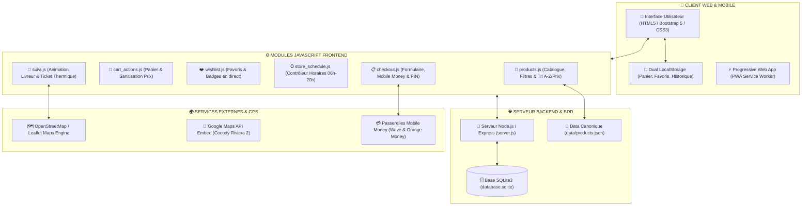
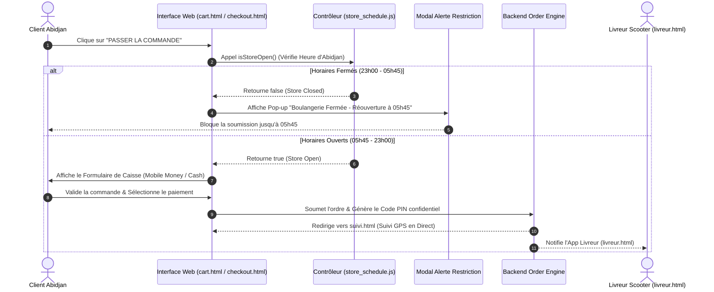
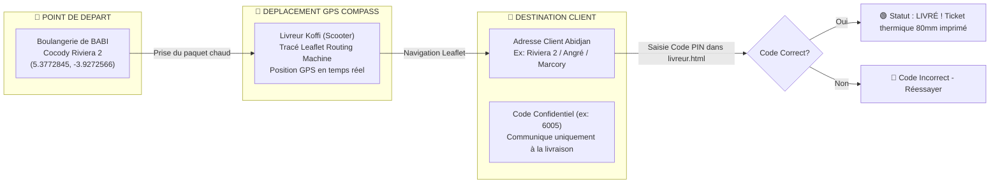

# 🥖 Architecture Technique du Projet — Boulangerie de BABI

> **Plateforme E-Commerce & Suivi de Livraison GPS en Temps Réel**  
> **Localisation Officielle :** Cocody Riviera 2, Abidjan, Côte d'Ivoire  
> **Téléphones Officiels :** Fixe `27 22 56 41 23` | Mobiles `07 04 38 92 01` / `07 06 81 79 77`  

---

## 📌 1. Vue d'Ensemble & Stack Technique

La plateforme **Boulangerie de BABI** est une application web e-commerce moderne, rapide, 100% responsive et optimisée pour l'écosystème ivoirien (Mobile Money, livraison à domicile à Abidjan, suivi GPS par scooter, tickets de caisse thermiques).

### 🛠️ Technologies Utilisées :
- **Frontend Core :** HTML5 sémantique, CSS3 (Vanilla + Bootstrap 5.3)
- **Typographie & Design System :** Google Fonts (*Playfair Display*, *Outfit*, *Inter*), FontAwesome 6
- **Logique Client :** JavaScript ES6+ (Architecture Modulaire)
- **Stockage Client :** Dual LocalStorage (*babi_cart_items*, *babi_cart*, *babi_wishlist*, *babi_current_order*)
- **Cartographie & GPS :** OpenStreetMap, Leaflet.js, Leaflet Routing Machine, Google Maps Embed
- **Backend & Persistence :** Node.js, Express.js, SQLite3 (`database.sqlite`)

---

## 📐 2. SCHÉMAS VISUELS DE L'ARCHITECTURE (DIAGRAMMES)

### 📊 Schéma 1 : Architecture Globale du Système



---

### 🔄 Schéma 2 : Diagramme du Cycle de Commande & Contrôle des Horaires (06h - 20h)



---

### 🛵 Schéma 3 : Interaction GPS Livreur & Client (Leaflet & Verification Code PIN)



---

### 🧾 Schéma 4 : Visualisation du Blueprint du Ticket Thermique 80mm

```text
+--------------------------------------------------+
|              BOULANGERIE DE BABI                 |
|         TEL: 2722564123 / 0704389201            |
|                     Recu                         |
|--------------------------------------------------|
| Receipt: 2512                                    |
| Date: 22 juil. 2026 12:07:54                     |
| Terminal: ONLINE-WEB                             |
| Caissier(e): CAISSES 1                           |
|--------------------------------------------------|
| Article                  Prix     Qte    Valeur  |
|--------------------------------------------------|
| PAIN AU CHOCOLAT        F 500     x2     F 1 000 |
| CROISSANT               F 500     x2     F 1 000 |
| JUS DE BAOBAB (PETIT)   F 300     x1     F   300 |
|--------------------------------------------------|
| Items count: 5                                   |
| Total TTC                                F 2 300 |
| Paiement (Mobile Money)                  F 2 300 |
|--------------------------------------------------|
|     Merci de votre visite a la Boulangerie       |
|               de Babi ! A bientot !              |
+--------------------------------------------------+
```

---

## 🏗️ 3. Structure & Arborescence du Projet

```text
Boulangerie de BABI/
├── 📄 index.html               # Vitrine principale, Carrousel HD, Four en direct, Produits phares
├── 📄 produits.html            # Catalogue complet (+80 produits) avec filtres & tri par prix
├── 📄 cart.html                # Panier interactif unifié avec gestion des quantités & codes promo
├── 📄 checkout.html            # Caisse & Prise de commande (Communes d'Abidjan, Mobile Money, Cash)
├── 📄 suivi.html               # Suivi de livraison GPS en direct + Reçu thermique imprimable 80mm
├── 📄 favoris.html             # Galerie des produits coups de cœur enregistrés
├── 📄 livreur.html             # Cockpit GPS du livreur (Style Uber Eats) avec validation par code PIN
├── 📄 fidelite.html            # Espace Club Fidélité (Cumul de points & Niveaux VIP)
├── 📄 contact.html             # Formulaire de contact & Carte Google Maps officielle (Riviera 2)
├── 📄 apropos.html             # Histoire & Savoir-faire artisanal de la boulangerie
├── 📄 connexion.html           # Page de connexion avec fond intérieur boulangerie sombre
├── 📄 inscription.html         # Page de création de compte client
├── 📄 admin.html               # Tableau de bord d'administration des commandes et stocks
├── 📄 meunu_officiel.md        # Document officiel des produits et tarifs de la boulangerie
├── 📄 ARCHITECTURE.md          # Présente architecture technique & schémas du projet
│
├── 📁 assets/                  # Photos HD des produits réels, logos & bannières
│   ├── logo.png                # Logo officiel BB (Le Pain de Babi)
│   ├── interieur_bakery.png    # Fond sombre d'ambiance d'intérieur de boutique
│   └── *.png                   # Visuels des pains, viennoiseries, pâtisseries, jus naturels
│
├── 📁 css/                     # Feuilles de style CSS
│   ├── global.css              # Variables de charte graphique (Chocolat & Ambre), resets, navbar & footers
│   ├── animations.css          # Effets de survol, micro-animations, pulse et transitions
│   ├── auth.css                # Styles spécifiques aux bannières de connexion/inscription
│   └── contact.css             # Styles de la page de contact et détails d'accès
│
├── 📁 js/                      # Modules JavaScript Frontend
│   ├── products.js             # Chargeur du catalogue, filtrage par catégorie & tri (A-Z, Prix)
│   ├── cart_actions.js         # Gestionnaire d'état du panier (Dual LocalStorage & Nettoyage prix)
│   ├── wishlist.js             # Gestionnaire des favoris (Ajout/Retrait & Badges en direct)
│   ├── store_schedule.js       # Gestionnaire des horaires d'ouverture (06h-20h) & Restriction de commande
│   ├── suivi.js                # Déplacement GPS animé du livreur Leaflet & Impression ticket thermique
│   ├── checkout.js             # Validation de commande, calcul des frais et génération de code PIN
│   ├── script.js               # Utilitaires globaux, affichage des mots de passe & animations
│   ├── auth.js                 # Logique d'authentification client
│   └── pwa.js                  # Progressive Web App Service Worker registration
│
├── 📁 data/                    # Données applicatives
│   └── products.json           # Base de données canonique des 87 produits de la boulangerie
│
├── 📁 scripts/                 # Scripts d'automatisation et de maintenance
│   ├── 📁 python/              # Scripts Python utilitaires de traitement d'images & HTML
│   └── 📁 js/                  # Scripts JS de migration et de peuplement BDD
│
├── 📄 server.js                # Serveur Backend Node.js / Express
└── 📄 database.sqlite          # Base de données SQLite pour l'historique des commandes
```

---

## 🌐 4. Modules Applicatifs & Fonctionnalités Clés

### 🥖 A. Catalogue & Recherche Intelligente (`js/products.js`)
- **Tri Alphabétique & Par Prix :** Tri par défaut de A à Z, dynamique par prix croissant/décroissant et nouveautés.
- **Filtrage Thématique :** Pains, Viennoiseries, Pâtisseries, Jus Naturels, Boissons, Glaces.
- **Liaison des Visuels Réels :** Association automatique des photos d'actifs réelles aux produits (*Baguettes 150/200, Croissants, Youki, Énergie Malt, Jus de Baobab, Bissap, etc.*).

### 🛒 B. Panier Unifié & Persistance (`js/cart_actions.js`)
- **Dual LocalStorage Sync :** Synchronisation simultanée entre `babi_cart_items` (tableau riche) et `babi_cart` (compatibilité legacy).
- **Sanitisation Numérique :** Nettoyage automatique des chaînes de prix (`replace(/[^0-9.]/g, '')`) pour éliminer tout risque de `NaN`.
- **Badges Temps Réel :** Mise à jour instantanée des compteurs de panier sur l'ensemble des pages.

### ❤️ C. Gestion des Favoris (`js/wishlist.js` & `favoris.html`)
- **Boutons Cœur Dynamiques :** Bascule instantanée de l'état favori avec retour visuel toast.
- **Page Galerie Dédiée (`favoris.html`) :** Vue synthétique des coups de cœur avec bouton d'ajout direct au panier.

### ⏰ D. Contrôleur des Horaires Boutique (`js/store_schedule.js`)
- **Plage d'Ouverture :** `05h45` à `23h00` (Heure d'Abidjan).
- **Programmes de Sortie de Pain :** `06h00`, `09h00`, `14h00`, `17h00`, `18h00`.
- **Restriction Automatique :** En dehors de cette plage, le passage de commande est bloqué et déclenche une fenêtre pop-up explicative (*"Les commandes réouvrent à 05h45"*).

### 🛵 E. Suivi GPS Livreur & Reçu Thermique (`suivi.html` & `js/suivi.js`)
- **Animation de Scooter en Direct :** Déplacement du livreur de **Cocody Riviera 2** vers l'adresse du client sur carte OpenStreetMap.
- **Code de Livraison Sécurisé :** Code PIN confidentiel à 4 chiffres généré pour la remise du colis.
- **Impression du Ticket Thermique Officiel :** Génération du reçu au format caisse thermique **80mm** (Logo BB, numéro de reçu, caissier, détails des articles et montants).

### 📱 F. Cockpit GPS Livreur (`livreur.html`)
- **Interface Style Uber Driver :** Guidage d'itinéraire Leaflet Routing, affichage des coordonnées client, bouton d'appel direct et validation par code PIN.

### 📦 G. Algorithme Kilométrique de Livraison & Barème (`checkout.html` & `js/checkout.js`)
- **Calculateur Kilométrique Officiel (`calculateDeliveryFeeByKm(km)`) :** Calcul automatique des kilomètres depuis la boulangerie (Cocody Riviera 2 : `5.37728, -3.92726`) à partir de 500 FCFA :
  - `km <= 3.0 km` : **500 FCFA** (Tarif de base / proximité : Riviera 2, Palmeraie, Anono... — *"3 km est égal à 500"*)
  - `3.0 km < km <= 5.0 km` : **1 000 FCFA** (Cocody étendu : Deux-Plateaux, Angré...)
  - `5.0 km < km <= 8.0 km` : **1 500 FCFA** (Plateau, Adjamé, Marcory Zone 4...)
  - `8.0 km < km <= 12.0 km` : **2 000 FCFA** (Koumassi, Treichville, Bingerville, Attécoubé...)
  - `km > 12.0 km` : **2 500 FCFA** (Yopougon, Abobo, Port-Bouët...)
- **Formule GPS Haversine :** Calcul mathématique exact en kilomètres (`computeHaversineDistance()`) lors de la capture GPS Porte-à-Porte.

---

## 📞 5. Coordonnées & Données Métier Officielles

- **Raison Sociale :** Boulangerie de BABI
- **Adresse Physiques :** Cocody Riviera 2, Abidjan - Côte d'Ivoire (GPS : `5.3772845, -3.9272566`)
- **Numéros Téléphoniques Officiels :**
  - ☎️ **Fixe :** `27 22 56 41 23`
  - 📱 **Mobile 1 :** `07 04 38 92 01`
  - 📱 **Mobile 2 :** `07 06 81 79 77`
- **Horaires d'Ouverture Boutique :**
  - **Lundi à Dimanche :** `05h45 – 23h00`
- **Programmes de Sortie de Pain :**
  - `06h00` • `09h00` • `14h00` • `17h00` • `18h00`

---
*Document avec Schémas Visuels généré pour le projet Boulangerie de BABI.*
