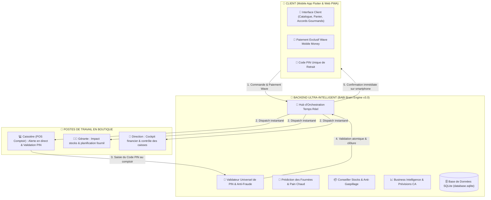
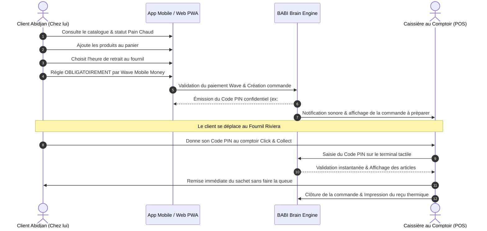

# 🥖 Architecture Technique du Projet — Boulangerie de BABI

> **Plateforme E-Commerce & Click & Collect Omnicanal avec Backend Ultra-Intelligent (BBE v3.0)**  
> **Localisation Officielle :** Riviera, Abidjan, Côte d'Ivoire  
> **Téléphones Officiels :** Fixe `27 00 00 00 00` | Mobiles `07 00 00 00 00` / `07 00 00 00 01`  

---

## 📌 1. Vue d'Ensemble & Modèle Économique

La plateforme **Boulangerie de BABI** est un écosystème commercial haut de gamme optimisé pour Abidjan, reposant sur un modèle **100% Click & Collect / Retrait Express au Fournil** :

1. **📱 Réservation en Ligne (Mobile App & Web PWA)** :
   - Le client réserve son pain ou ses viennoiseries depuis chez lui.
   - **Moyen de paiement exclusif en ligne : Wave Mobile Money** (garantit 0% de faux engagements et élimine l'attente).
   - Génération instantanée d'un **Code PIN unique confidentiel**.

2. **🏬 Retrait Express au Fournil (Comptoir Dédié)** :
   - Le client se présente au comptoir sans faire la queue.
   - La caissière saisit le code PIN sur son terminal tactile POS pour valider la remise.

3. **💵 Ventes Directes en Boutique (Clients sur place)** :
   - Les clients venus physiquement faire la queue peuvent régler en Espèces (Cash) ou Wave directement à la caisse.

---

## 📐 2. SCHÉMAS VISUELS DE L'ARCHITECTURE (DIAGRAMMES)

### 📊 Schéma 1 : Architecture Globale du Système Connecté



---

### 🔄 Schéma 2 : Parcours de Commande en Ligne & Retrait Express



---

### 🧾 Schéma 3 : Ticket Thermique 80mm de Caisse

```text
+--------------------------------------------------+
|              BOULANGERIE DE BABI                 |
|         Riviera, Abidjan - Côte d'Ivoire         |
|           TEL: 27 00 00 00 00 / 07 00 00 00 00   |
|--------------------------------------------------|
| Ticket N°: #1042                                 |
| Date: 23 août 2026 à 18:30:15                    |
| Mode: CLICK & COLLECT (Paiement Wave Vérifié)    |
| Opérateur: Caissière Caisse 1                    |
| Code Retrait: #7890 (Validé & Scellé)            |
|--------------------------------------------------|
| Article                  Prix     Qte    Valeur  |
|--------------------------------------------------|
| BAGUETTE TRADITION      F 400     x2     F   800 |
| CROISSANT PUR BEURRE    F 600     x3     F 1 800 |
| JUS DE BISSAP MAISON    F 1000    x1     F 1 000 |
|--------------------------------------------------|
| TOTAL PAYÉ (WAVE) :                     F 3 600  |
| RETRAIT FOURNIL :                       GRATUIT  |
|--------------------------------------------------|
|        MERCI DE VOTRE VISITE ET À BIENTÔT !      |
|             BOULANGERIE DE BABI RIVIERA          |
+--------------------------------------------------+
```

---

## 🛠️ 3. Structure des 4 Rôles de la Plateforme

| Rôle | Interface | Responsabilités | Mode de Paiement |
| :--- | :--- | :--- | :--- |
| **Client** | `index.html`, `produits.html`, `cart.html`, `checkout.html`, `suivi.html`, App Mobile Flutter | Consultation, réservations, pain chaud en direct, suivi PIN. | **Wave Mobile Money Exclusif** |
| **Caissière** | `index.html` & `js/caissiere.js` | Réception en direct des commandes, validation PIN, encaissement sur place. | Validation PIN + Ventes Espèces/Wave |
| **Gérante** | `index.html` & `js/gerante.js` | Pilotage des fournées, alertes de stocks, mode anti-gaspillage. | Consultation |
| **Administrateur** | `index.html` & `js/admin.js` | Cockpit financier, gestion des accès caissières, audit de sécurité. | Trésorerie & Payouts |
