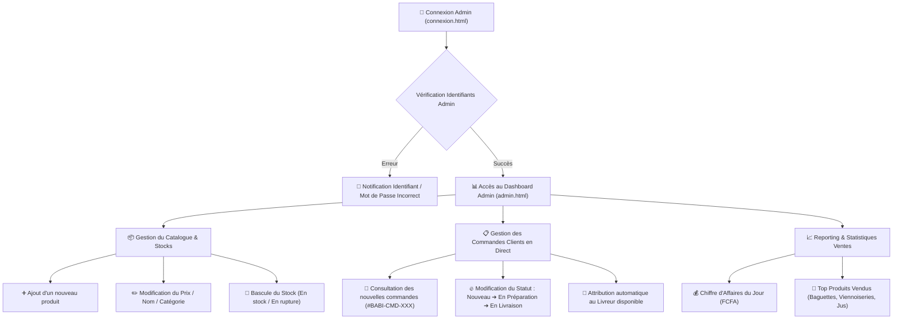
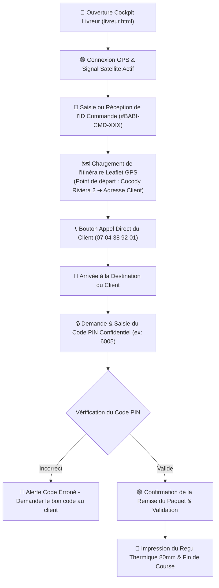
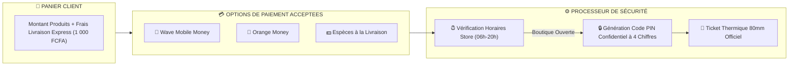

# 🚴‍♂️ Parcours Utilisateurs & Cartographie des Flux — Boulangerie de BABI

> **Document de Référence des Schémas de Navigation : Client, Administrateur et Livreur GPS**  
> **Intégration des Modes de Paiement (Mobile Money & Espèces)**  
> **Localisation Officielle :** Cocody Riviera 2, Abidjan - Côte d'Ivoire  

---

## 🛍️ 1. Parcours Complet du Client (Customer Journey)

Ce schéma détaille chaque étape franchie par un client abidjanais, depuis son arrivée sur la vitrine jusqu'à la réception de son pain chaud et de son reçu thermique 80mm.

```mermaid
flowchart TD
    A["🌐 Arrivée sur index.html\n(Vitrine, Slogans HD & Four en direct)"] --> B{"Boutique Ouverte ?\n(05h45 - 23h00 Abidjan)"}
    
    B -->|Non (23h00 - 05h45)| C["🥐 Pop-up d'Alerte : Ouverture à 05h45\n(Commande bloquée temporairement)"]
    B -->|Oui (05h45 - 23h00)| D["🔍 Navigation & Recherche Produit\n(A-Z, Filtrage Catégories, Tri par Prix)"]
    
    D --> E["❤️ Ajout aux Favoris (favoris.html)"]
    D --> F["🛒 Ajout au Panier Unifié (cart.html)"]
    
    F --> G["📋 Saisie Adresse & Commune à Abidjan\n(Calcul Algorithmique des Frais km dès 500 FCFA : 0-3km=500F, 3-5km=1000F...)"]
    
    G --> H{"Choix du Mode de Paiement"}
    H -->|Wave Mobile Money| I1["🌊 Transaction Wave"]
    H -->|Orange Money| I2["🍊 Transaction Orange Money"]
    H -->|Espèces| I3["💵 Paiement Cash à la Livraison"]
    
    I1 --> J["🔒 Génération de la Commande & Code PIN à 4 chiffres\n(ex: #BABI-CMD-884920 | PIN: 6005)"]
    I2 --> J
    I3 --> J
    
    J --> K["🛵 Redirection vers suivi.html\n(Suivi GPS en Direct + Reçu Thermique 80mm)"]
```

---

## 👨‍💼 2. Parcours de l'Administrateur (Admin User Flow)

Ce schéma décrit le processus de gestion utilisé par l'équipe de la boulangerie pour piloter les stocks, les prix et traiter les commandes entrantes.



---

## 🛵 3. Parcours du Livreur GPS (Rider User Flow)

Ce schéma modélise le parcours du livreur en scooter depuis la prise en charge de la commande à la boulangerie jusqu'à la validation sécurisée par code PIN.



---

## 💳 4. Schéma de Traitement des Modes de Paiement (Payment Flow)



---

## 🧾 5. Modèle Visuel du Ticket de Caisse Thermique Imprimable (80mm)

```text
+--------------------------------------------------+
|              BOULANGERIE DE BABI                 |
|   TEL: 2722564123 / 0704389201 / 0706817977      |
|                     Recu                         |
|--------------------------------------------------|
| Receipt: 2512                                    |
| Date: 22 juil. 2026 12:07:54                     |
| Terminal: ONLINE-WEB                             |
| Caissier(e): CAISSES 1                           |
|--------------------------------------------------|
| Article                  Prix     Qte    Valeur  |
|--------------------------------------------------|
| PAIN AU CHOCOLAT        F 500     x2     F 1 000 |
| CROISSANT               F 500     x2     F 1 000 |
| JUS DE BAOBAB (PETIT)   F 300     x1     F   300 |
|--------------------------------------------------|
| Items count: 5                                   |
| Total TTC                                F 2 300 |
| Paiement (Wave / OM / Cash)              F 2 300 |
|--------------------------------------------------|
|     Merci de votre visite a la Boulangerie       |
|               de Babi ! A bientot !              |
+--------------------------------------------------+
```

---
*Document des Parcours Utilisateurs généré pour la Boulangerie de BABI.*
