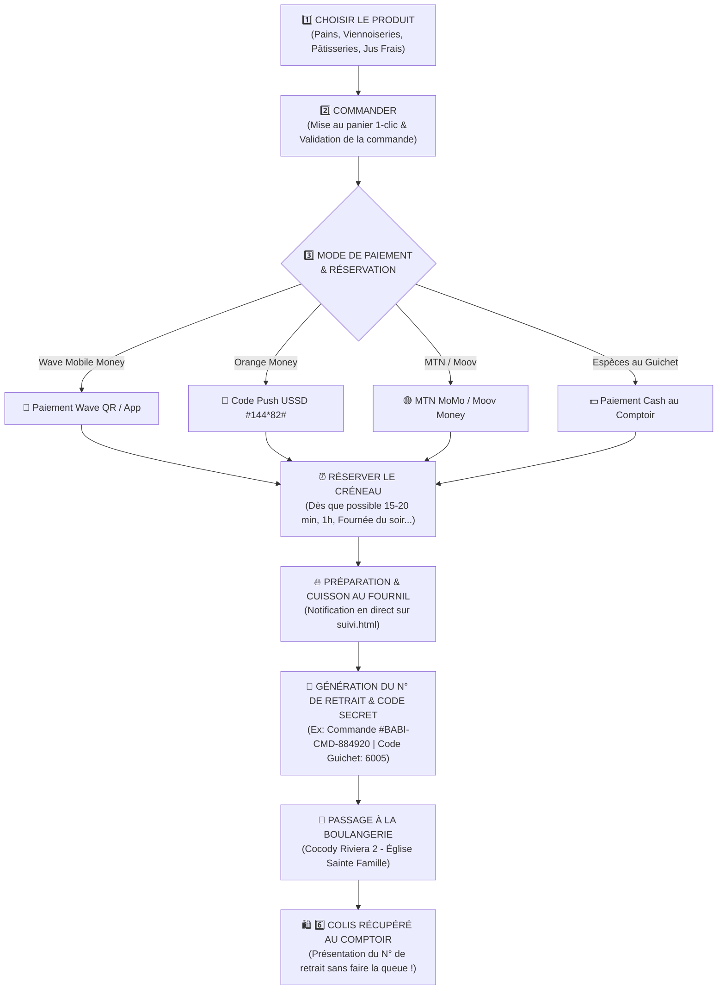
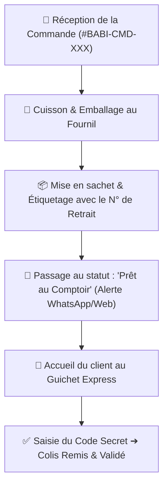

# 🥖 Parcours Utilisateurs & Cartographie Click & Collect — Boulangerie de BABI

> **Document de Référence :** Parcours Client Click & Collect, Gestion Fournil & Comptoir  
> **Modèle Économique :** Commande en ligne, Préparation artisanale au Fournil & Retrait Express en Boutique (0 FCFA)  
> **Localisation Officielle :** Cocody Riviera 2, Boulevard Sainte Famille, Abidjan - Côte d'Ivoire  

---

## 🛍️ 1. Parcours Officiel du Client (Customer Journey)

Ce schéma détaille chaque étape du parcours : **Choisir le produit ➔ Commander ➔ Mode de paiement ➔ Réserver le créneau ➔ Cuisson au fournil ➔ N° de Retrait ➔ Passage à la Boulangerie ➔ Colis Récupéré**.

---

## 👨‍💼 2. Parcours de l'Équipe Fournil & Comptoir (Merchant Flow)

Ce schéma décrit le processus de traitement des réservations par l'équipe en boutique :

---

## 📋 Tableau Récapitulatif des Étapes du Client

| Étape | Action Client | Interface / Page | Résultat / Notification |
| :--- | :--- | :--- | :--- |
| **1. Choisir** | Explore le catalogue et les catégories | [index.html](file:///c:/Users/ezemi/Downloads/Boulangerie-de-BABI-main/Boulangerie-de-BABI-main/index.html) & [produits.html](file:///c:/Users/ezemi/Downloads/Boulangerie-de-BABI-main/Boulangerie-de-BABI-main/produits.html) | Produits ajoutés au panier |
| **2. Commander** | Renseigne son nom & numéro de téléphone | [cart.html](file:///c:/Users/ezemi/Downloads/Boulangerie-de-BABI-main/Boulangerie-de-BABI-main/cart.html) & [checkout.html](file:///c:/Users/ezemi/Downloads/Boulangerie-de-BABI-main/Boulangerie-de-BABI-main/checkout.html) | Panier validé sans frais (0 FCFA) |
| **3. Payer & Réserver** | Sélectionne Wave / OM / Espèces et choisit l'heure de retrait | [checkout.html](file:///c:/Users/ezemi/Downloads/Boulangerie-de-BABI-main/Boulangerie-de-BABI-main/checkout.html) | Créneau réservé au fournil |
| **4. Préparation (Prêt)** | Suit l'état d'avancement de la cuisson | [suivi.html](file:///c:/Users/ezemi/Downloads/Boulangerie-de-BABI-main/Boulangerie-de-BABI-main/suivi.html) | Notification : *« Prête au comptoir ! »* |
| **5. N° de Retrait** | Récupère son N° de commande & Code PIN | [suivi.html](file:///c:/Users/ezemi/Downloads/Boulangerie-de-BABI-main/Boulangerie-de-BABI-main/suivi.html) & WhatsApp | Ticket & QR Code de retrait généré |
| **6. Colis Récupéré** | Vient à la boutique de Cocody Riviera 2 | Comptoir Boulangerie de BABI | Colis tout chaud remis en mains propres |
