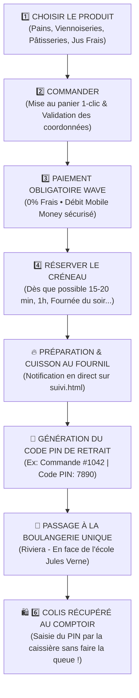
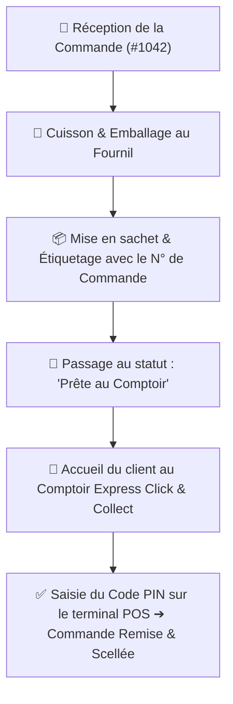

# 🥖 Parcours Utilisateurs & Cartographie Click & Collect — Boulangerie de BABI

> **Document de Référence :** Parcours Client Click & Collect, Gestion Fournil & Comptoir  
> **Modèle Économique :** Réservation 100% Wave en ligne, Préparation artisanale au Fournil & Retrait Express en Boutique (0 FCFA)  
> **Localisation Officielle Unique :** Riviera (En face de l'école Jules Verne), Abidjan - Côte d'Ivoire  

---

## 🛍️ 1. Parcours Officiel du Client (Customer Journey)

Ce schéma détaille chaque étape du parcours : **Choisir le produit ➔ Commander ➔ Paiement Sécurisé Wave ➔ Réserver le créneau ➔ Cuisson au fournil ➔ Code PIN de Retrait ➔ Passage à la Boulangerie ➔ Colis Récupéré**.

---

## 👨‍💼 2. Parcours de l'Équipe Fournil & Comptoir (Merchant Flow)

Ce schéma décrit le processus de traitement des réservations par l'équipe en boutique :

---

## 📋 Tableau Récapitulatif des Étapes du Client

| Étape | Action Client | Interface / Page | Résultat / Notification |
| :--- | :--- | :--- | :--- |
| **1. Choisir** | Explore le catalogue et les catégories | `index.html` & `produits.html` | Produits ajoutés au panier |
| **2. Commander** | Renseigne son nom & numéro de téléphone | `cart.html` & `checkout.html` | Coordonnées validées |
| **3. Payer & Réserver** | Règle par Wave Money et choisit l'heure de retrait | `checkout.html` | Paiement validé & créneau réservé |
| **4. Préparation** | Suit l'état d'avancement au fournil | `suivi.html` | Notification : *« Prête au comptoir ! »* |
| **5. Code PIN** | Reçoit son Code PIN confidentiel unique | `suivi.html` & WhatsApp | Pass PIN à 4 chiffres généré |
| **6. Retrait au Fournil** | Vient à l'unique boutique de Riviera (Jules Verne) | Comptoir Retrait Express POS | Colis tout chaud remis en mains propres |
